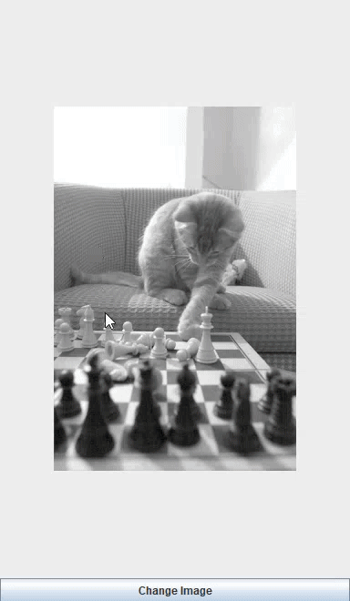

# Cat Viewer 9000

Cat Viewer 9000 is a simple Java application that fetches and displays random cat images from [The Cat API](https://thecatapi.com/). Click the "Change Image" button to fetch a new random cat image.

---

## Demo

---

## Features

- Fetches random cat images from The Cat API.
- A button to fetch and display a new random cat image.

---

## Prerequisites

- Java 8 or higher
- Internet connection (to fetch images)

---

## How to Run

- Open project in eclipse IDE
- Run
- Not guaranteed to work with other IDEs